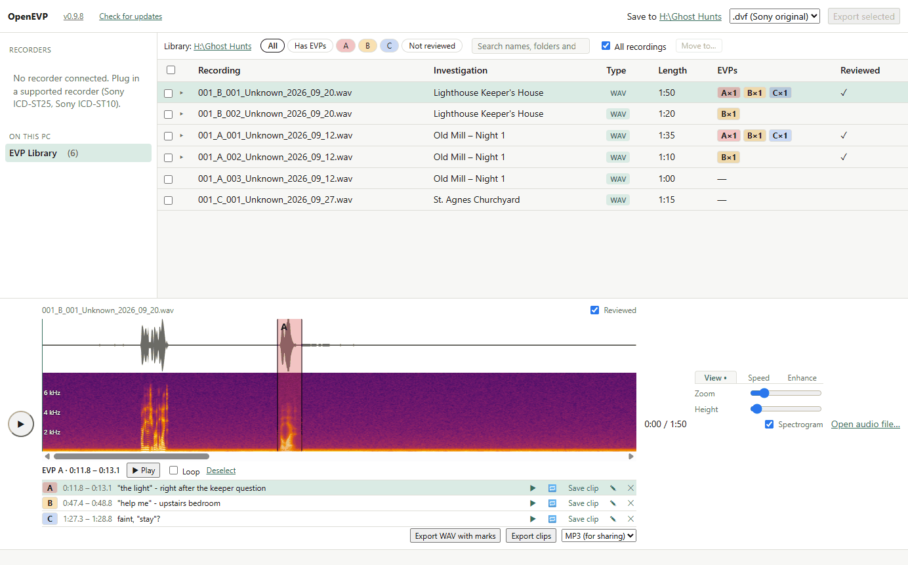
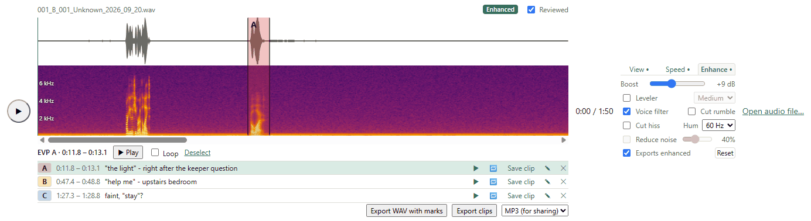
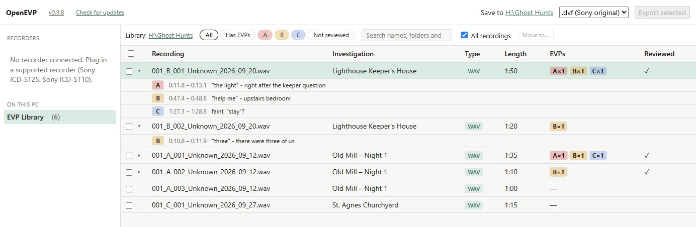

# OpenEVP

**Get the recordings off your Sony voice recorder, then find, mark and share your EVPs.**

### [⬇ Download OpenEVP for Windows](https://github.com/MBarc/OpenEVP/releases/latest)

Free and open source. One installer, Windows 10 and 11.

If you hunt with a Sony ICD-ST25 or ICD-ST10, you probably know the problem.
Great recorder, dead software. Sony's old program doesn't run on a modern
Windows PC, so I wrote this for my team. You plug the recorder in, OpenEVP
pulls the recordings off, and you can go through them properly. 👻

## Your recorder works on a modern PC again

No Sony software, and no old 32-bit computer kept around just to read the
recorder. Install OpenEVP, plug in the recorder, tick the recordings and click
**Export**. It only ever reads from the recorder, so nothing on it gets
changed or deleted.

## See the voice before you hear it

Every recording opens with its waveform and a spectrogram underneath. The
spectrogram is a picture of the sound: time runs across, pitch goes up, and
louder is brighter. A voice shows up as a stack of bright stripes, so you can
often spot it even when it's buried in noise.

## Slow it down and clean it up

Found something faint? Loop it. Slow it down to a quarter of normal speed (or
speed it up to 2×), with the voice kept at its normal pitch or dropped like a
slowed-down tape.

The **Enhance** tab makes it louder, evens out the volume, keeps only the
range voices sit in, and takes out rumble, hiss and electrical hum. It all
happens live while you listen. There's also noise reduction that learns your
room's background noise (fans, air conditioning, traffic) and turns it down.

None of this touches the recording. It only changes what you hear.

## Mark it and keep every investigation in order

Drag across the waveform, press **M**, and pick a class: A if anyone would
hear the words, B if most people would agree, C if it's faint. Write down what
you hear. Marks save themselves.

Everything you've saved lands in the **EVP Library**, with a folder per
investigation. You can see at a glance how many A, B and C EVPs each recording
has, and filter down to "has EVPs" or "not reviewed yet" when you're working
through a night's audio.

## Share a clip with the team

Each EVP can be saved as its own short clip, an MP3 for sharing or a
full-quality WAV. Then drag it from the library straight into Discord,
WhatsApp, an email or a folder. Or right-click it, pick **Copy file**, and
paste it with Ctrl+V.

Dragging out a Sony `.dvf` file (which other programs can't play)? OpenEVP
sends a playable copy instead. Your original never moves.

## A few more things

- It opens WAV and MP3 files from anywhere on your PC, including voice notes
  and clips saved from WhatsApp Web.
- Right-click any recording to show it in File Explorer, rename it, or delete
  it. Deleted recordings go to the Recycle Bin, and if you restore one, its
  EVP marks come back with it.
- It updates itself. When there's a new version it tells you and installs it
  for you.

### [⬇ Download OpenEVP for Windows](https://github.com/MBarc/OpenEVP/releases/latest)

## Works with

| Recorder | Works? |
|---|---|
| Sony ICD-ST25 | Yes |
| Sony ICD-ST10 | Yes, in all three of its recording modes (ST, SP and LP) |
| Panasonic RR-DR60 | No. It has no PC connection at all, only a headphone jack. Recording it through a PC's line-in socket might happen one day, but I'm not promising anything. |

Got a different recorder? [Open an issue](https://github.com/MBarc/OpenEVP/issues)
(that's GitHub's name for a request or bug report) and tell me which one.

## Quick start

1. **[Download](https://github.com/MBarc/OpenEVP/releases/latest)**
   `OpenEVP-Setup-<version>.exe` and run it. When Windows asks for permission,
   click **Yes**. The installer sets up everything, including the driver that
   lets the PC talk to the recorder.
2. Plug in your recorder and open **OpenEVP** from the Start menu. Click the
   recorder on the left, tick the recordings you want and click **Export**.
   They're saved to `Documents\OpenEVP`.
3. Click a recording to play it. When you hear something, drag across that
   part of the waveform and press **M** to mark it.

That's enough to get through your first hunt. The [user guide](docs/user-guide.md)
covers the rest.

## FAQ

### Is it free?

Yes, with no trial and no account. It's open source under the GPL licence
(see [Licence](#licence)), so anyone can read the code and check what it does.

### Windows says "Windows protected your PC". Is it safe?

Click **More info**, then **Run anyway**. Windows shows that warning the first
time because the installer isn't code-signed, meaning it doesn't carry a paid
certificate from a commercial company that tells Windows who made it. It isn't
a sign that anything is wrong. The code is public, and every update is checked
against the project's own signing key before it's installed.

### Will it change my recordings?

No. OpenEVP only reads from your recorder, so nothing on it is changed or
deleted. Saved files are never overwritten. Speed, Enhance and noise reduction
only change what you hear, never the file. Your EVP marks are kept separately
from the audio, so they're safe too.

The only time a file goes anywhere is when you delete it yourself. OpenEVP
asks first, and it goes to the Recycle Bin.

### Does it work on a Mac?

Not yet, sorry Mac people. It needs 64-bit (x64) Windows 10, version 2004 or
later, or Windows 11. It won't run on Windows in "S mode" (a locked-down mode
that only allows apps from the Microsoft Store), and PCs with an ARM chip
aren't supported yet. Not sure what you've got? **Settings → System → About**
shows it under "System type".

### Where do my files go?

To `Documents\OpenEVP`, with one subfolder per folder on the recorder. Click
the **Save to** path in the app to open it, or **Change…** to pick another
folder. Your EVP marks and settings are kept separately, in
`%APPDATA%\OpenEVP` (paste that into File Explorer's address bar to get
there).

### How do updates work?

When OpenEVP starts, it checks GitHub for a newer version. If there is one, it
shows what's new and offers **Update now** or **Not now**. **Update now**
downloads the installer, checks that it really comes from this project, asks
Windows for permission and reopens OpenEVP on the new version. You can also
click **Check for updates** at the top of the window any time.

### The recorder shows as "needs setup", or seems stuck

See [Troubleshooting](docs/user-guide.md#troubleshooting) in the user guide.
It's usually fixed by one button or by unplugging the cable.

## More reading

- [User guide](docs/user-guide.md): every feature, step by step.
- [Technical documentation](docs/technical.md): how OpenEVP talks to the
  recorders, why the ICD-ST25 needed it, the driver setup, the command-line
  tool and how to build it.
- [Adding a recorder](openevp/recorders/README.md), for developers.

Try it after your next hunt, and if something breaks,
[tell me](https://github.com/MBarc/OpenEVP/issues).

## Licence

Copyright (C) 2026 Michael Barcelo. OpenEVP is free software under the
GNU General Public License v3.0 or later; see [`LICENSE`](LICENSE).

## Legal

OpenEVP is an independent project and is not affiliated with, endorsed by, or
supported by Sony or Panasonic. "Sony", "ICD-ST25", "ICD-ST10" and "Digital
Voice Editor" are trademarks of Sony Corporation. "Panasonic" and "RR-DR60" are
trademarks of Panasonic Corporation.

To play and convert recordings made on Sony IC recorders, OpenEVP includes
numeric tables needed to read Sony's LPEC audio formats (LPEC LP, used by the
ICD-ST25 and ICD-ST10, and LPEC SP and LPEC ST, used by the ICD-ST10). They are
included only so owners can access their own recordings (interoperability).
Rights holders who object can open an issue at
https://github.com/MBarc/OpenEVP/issues and the tables will be removed
promptly. The tables ship inside the installer only, as three data files
(`openevp/decoders/sony_lpec/data/lpec_tables.json` for LPEC LP,
`openevp/decoders/sony_lpec/data/lpec_sp_tables.json` for LPEC SP and
`openevp/decoders/sony_lpec_st/data/lpec_st_tables.json` for LPEC ST); they are
not part of this repository.

OpenEVP is provided "as is", without warranty of any kind.

## Third-party notices

OpenEVP includes work by other people. Here is what it uses and under which
licence:

- **libusb:** `vendor/libusb-1.0.30/libusb-1.0.dll` is libusb 1.0.30 (MinGW64
  build) from the official PGP-signed release (signed by Tormod Volden),
  licensed LGPL-2.1; see `vendor/libusb-1.0.30/COPYING`. The build script
  checks its SHA-256.
- **lameenc and LAME:** MP3 clips are encoded with
  [lameenc](https://github.com/chrisstaite/lameenc) (installed from PyPI,
  `requirements-app.txt`), licensed LGPL-3.0-or-later, which includes the
  [LAME](https://lame.sourceforge.io/) MP3 encoder, licensed
  LGPL-2.0-or-later. The app bundles it as a separate extension module
  (`_internal\lameenc.*.pyd`), with its license in
  `_internal\lameenc-*.dist-info`.
- **minimp3:** MP3 files are decoded with
  [minimp3](https://github.com/lieff/minimp3), dedicated to the public domain
  under CC0 1.0 Universal; see `vendor/minimp3/LICENSE`.
  `vendor/minimp3/minimp3.h` is commit
  `ea99364f61c14656440e8d77e9c233ccf3124633` (2026-07-27), pinned by SHA-256
  in `tools/build_lpec_core.py`; it is compiled into
  `openevp/decoders/mp3/mp3_core.dll` with OpenEVP's own wrapper (`_mp3.c`).
  On x86-64 minimp3 always takes its SSE2 code path, so the same file decodes
  to the same samples on every PC.
- **Chromium DynamicsCompressor:** the Leveler (`openevp/leveler.py`) is a
  port of Chromium's Web Audio DynamicsCompressor
  (`third_party/blink/renderer/platform/audio/dynamics_compressor.cc`,
  Copyright (C) 2011 Google Inc.), licensed BSD-3-Clause; the full notice is in
  [`LICENSES/chromium-dynamics-compressor.txt`](LICENSES/chromium-dynamics-compressor.txt),
  which the app bundles (`_internal\LICENSES\`) and the release check verifies.
- **WebView2:** `vendor/webview2/MicrosoftEdgeWebview2Setup.exe` is
  Microsoft's Evergreen WebView2 bootstrapper (Authenticode-signed by
  Microsoft; the build checks its SHA-256). It is redistributable, and the
  installer runs it only when WebView2 is missing.
- **wavesurfer.js:** `app/ui/vendor/wavesurfer.min.js` is wavesurfer.js
  (BSD-3-Clause).
